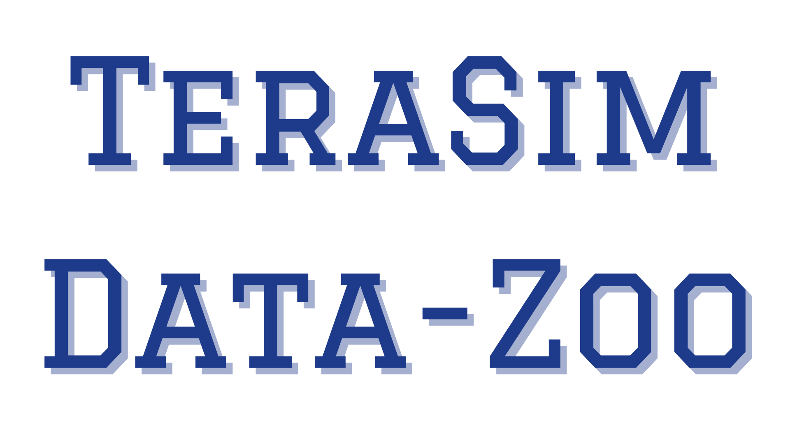

# TeraSim Data Zoo

<div align="center">
<p align="center">



</p>
</div>

A comprehensive toolkit for integrating various autonomous driving datasets with the TeraSim simulation platform, enabling standardized traffic scenario simulation and analysis.

## Overview

TeraSim Data Zoo is an extensible framework designed to bridge the gap between diverse autonomous driving datasets and the TeraSim simulation platform. It provides a unified interface for converting, processing, and simulating traffic scenarios from multiple data sources.

### Supported Datasets

- Waymo Open Motion Dataset
- nuScenes (Coming Soon)
- nuPlan (Coming Soon)
- Custom Dataset Integration Support

## Key Features

- **Universal Data Integration**
  - Standardized pipeline for converting various dataset formats to SUMO-compatible scenarios
  - Extensible architecture for adding new dataset support
  - Custom dataset integration framework

- **Simulation Capabilities**
  - Scenario-specific simulation configuration
  - GUI and headless simulation modes
  - Batch processing for multiple scenarios
  - Detailed logging and data extraction

- **Analysis Tools**
  - Unified data analysis interface
  - Scenario comparison across different datasets
  - Performance metrics computation
  - Visualization utilities

## System Architecture

```
terasim-data-zoo/
├── src/
│   ├── scenparse/           # Core scenario parsing framework
│   ├── converters/          # Dataset-specific converters
│   │   ├── waymo/          # Waymo dataset converter
│   │   ├── nuscenes/       # nuScenes converter (planned)
│   │   └── nuplan/         # nuPlan converter (planned)
│   └── analysis/           # Analysis tools
├── scripts/                # Utility scripts
└── examples/              # Example usage for each dataset
```

## Prerequisites

- Python 3.7+
- TeraSim
- SUMO (Simulation of Urban MObility)
- Dataset-specific dependencies:
  - Waymo Open Dataset API
  - nuScenes devkit (for nuScenes support)
  - nuPlan devkit (for nuPlan support)

## Installation

1. Clone the repository:
    ```bash
    git clone [repository-url]
    cd terasim-data-zoo
    ```

2. Install dependencies:
    ```bash
    pip install -r requirements.txt
    ```

3. Install dataset-specific requirements (optional):
    ```bash
    pip install -r requirements-waymo.txt  # For Waymo support
    pip install -r requirements-nuscenes.txt  # For nuScenes support
    ```

## Usage

### Dataset Conversion

Convert scenarios from supported datasets to SUMO format:

```bash
# For Waymo dataset
python waymo_to_sumo.py INPUT_PATH [OPTIONS]

# For other datasets (coming soon)
python convert.py --dataset [dataset_name] INPUT_PATH [OPTIONS]
```

### Running Simulations

Execute TeraSim simulation with converted data:

```bash
python terasim_main.py --dataset [dataset_name] SCENARIO_PATH [OPTIONS]
```

Common options:
- `--scenario-id TEXT`: Specific scenario to simulate
- `--name TEXT`: Experiment name
- `--output-dir TEXT`: Output directory
- `--gui / --no-gui`: Enable/disable SUMO GUI

### Example Workflows

See the provided example scripts for complete workflows:
```bash
# Waymo workflow
./examples/waymo_example.sh

# nuScenes workflow (coming soon)
./examples/nuscenes_example.sh
```

## Extending TeraSim Data Zoo

### Adding New Dataset Support

1. Create a new converter module in `src/converters/`
2. Implement the required converter interfaces
3. Add dataset-specific configuration and documentation
4. Provide example scripts and usage documentation

See the developer guide for detailed instructions on implementing new dataset support.

## Contributing

We welcome contributions to expand dataset support and improve functionality. Please refer to our contribution guidelines for more information.

## License

This project is closed source and not available for public use or distribution.

## Contact

For bug reports and feature requests, please open an issue in the repository.

---

Part of the TeraSim ecosystem. For more information about TeraSim, visit [TeraSim Documentation](https://github.com/michigan-traffic-lab/TeraSim).
